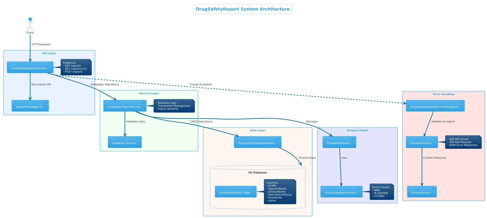
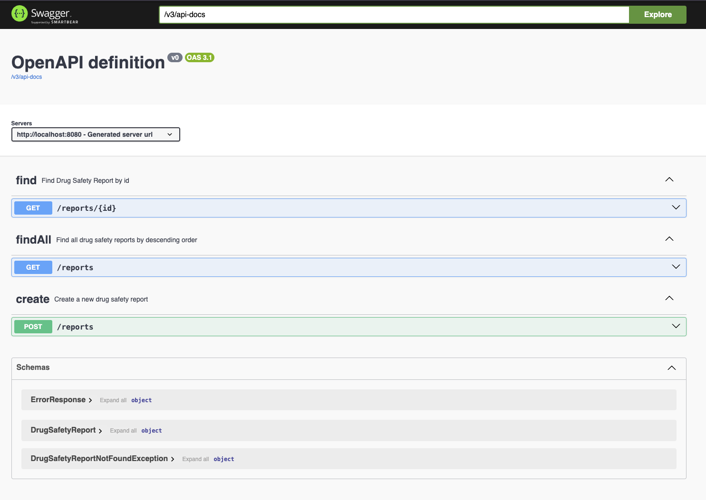
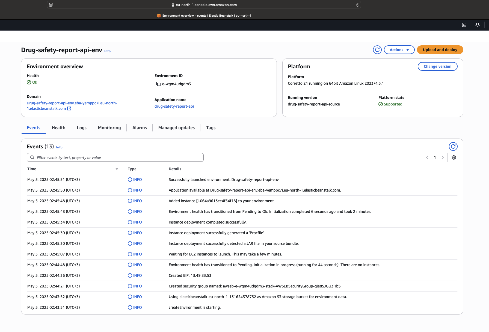

reqressiongDrug Safety Report API prototype
===
---

Architectural overview
===
---
In this section will go through Drug Safety Report API in detail. First by showing the architectural image and then go through the architectural parts and decisions.



Image 1: Architectural view of Drug Safety Report API

## Architecture
This is quite simple Spring Boot application with only bare bones to run it. Before going through Spring related architectural choices there were some

### Baseline technical choices made:
1. Choosed Java as programming language (although Kotlin was a good contender)
2. Choosed H2 as storage for ease of use

Then came technical choices granted: needed to be Spring Boot application.

### Application package level design
First architectural choice was to have only Controller, without any Service classes as this is more of demo or prototype for API. That followed structuring code into best practice way with Spring applications: controller, model, repository and util plus enums.
Last two were there to model data. 

Controller package has one Controller: DrugSafetyReportController that controls flow to API endpoints.

Enums package has one enum class that models specified status enum in drug safety report.

Model package has one model that model drug safety report data.

Repository package has one Repository interface that extends JpaRepository and acts primarily as a marker interface to capture the types to work with and to help you to discover interfaces that extend this one. The CrudRepository provides sophisticated CRUD functionality for the entity class that is being managed.

Util package has Exception that is thrown when no report is found with given report id, when querying for certain reports. There are also help classes to make sure exceptions message is in JSON format and making sure that Controllers throws correct exception, when no report is found. This done with advice class.

## API architecture
Open API was chosen as way to test API from simple user interface by non-developer and it also documents API well.



Image 2: Swagger view of Drug Safety Report API

## Test architecture
Error handling needed to be tested correctly (404 responses with proper JSON format). Validation needed to be tested for all required fields. JSON response structure needed to be correct for both success and error cases and different status values (NEW, CLOSED) needed to be tested properly.

## Architectural Decision Records (ADR's)
In this prototype most architectural decision are are documented separately in their own files. More info about (click "ADR" link) [ADR](https://github.com/joelparkerhenderson/architecture-decision-record?tab=readme-ov-file) .

1. [Baseline architectural choice](./adrs/1_adr_baseline_application.md)
2. [Swagger desicion](./adrs/2_adr_swagger_library_selection.md)
3. [Dockerfile](./adrs/3_adr_dockerize_solution)
4. [Domain model](./adrs/4_adr_domain_model.md)
5. [Tests](./adrs/5_adr_tests)

How to run and build the project
===
---

## Building this project
Building the project is straight forward and has couple of steps that vary depending are we doing local execution or using container.

## Local building and executing
To run this application locally you need to follow steps below:

1. Before running the application from command line following command should be executed first:
```shell
chmod +x mvnm
```
This makes sure that mvnw (short for maven wrapper) is executable.

2. Create local package of this project by executing shell command from below:

```shell
./mvnm clean package
```

3. You can run the application locally without Docker or AWS. Just type in following command:

```shell
./mvnw spring-boot:run
```
## Run with Docker compose
There is a Dockerfile defining application and a compose file that creates everything. First again run package from cleaned and then compose the app up.

```shell
docker compose up --build
```

## Executing tests
Executing test can be easily verified by running following command:
```shell
./mvnw test
```
This executes test suites that covers current Controller.

How to deploy
===
---

## Deploy to AWS
Simply create a new Elastic Beanstalk application and deployed Drug Safety Report API using that. Then tested all functionality using Swagger UI.



Image 3: Deployed Drug Safety Report API

### Proof of deployment
Proof of deployment is visible from Image 3 and link below:

[Proof of deployment](./docs/video/drug-safety-report-api-running-in-aws.mov)

Future developments
===
---
There are many things this application needs still to be more than a demo, or prototype. It is now running in AWS Elastic Beanstalk, it is container based via Docker, has good code coverage and work as specified, but to make this application production ready there are couple of things in-order to make MVP application.

Architecture would go through review phase and would probably be changed to provide more production ready features. And of course any fixes to prototype like behaviour that is certainly there at the moment. 

Most notable change would be to add a service package and refactor Controller to call services. This would also be better in long run, as there might come new services and controllers. This was not implemented as the scope
was to create simple Drug Safety Report API that can be used from web interface using Swagger (or OpenAPI in this case).

Database would be needed to transformed to something else than a in-memory database for consistency and access for other application. This would also mean that database would it's own microservice and deployed separately. 
Drug Safete Report API would then try to connect to database.

Deployment automation using Terraform or similar tool and also create CI/CD for whole process. Also planning for scaling and other DevOps needed to run this application mostly without human interaction.

Also monitoring for application needs to be designed and implemented. This could be Prometheus or similar tool.

Fail-safe operations would be needed to designed, in-order to help provide application self-healing capabilities.

Also better testing would be added, those that are needed to go to production: integration testing, system testing and provide reqression testing to keep application in working order for years to come.

Lastly Kubernetes could be tested and prototyped instead of Docker for better deployment strategy and management, not to mention capability to use other container technogies than Docker, as sometimes Docker has quite costly licenses and similar ones can be find Open Sourced.
